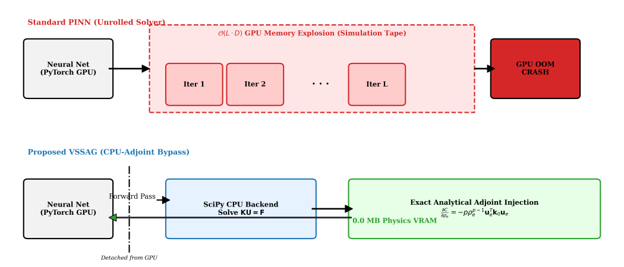
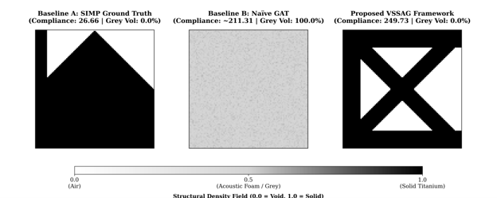
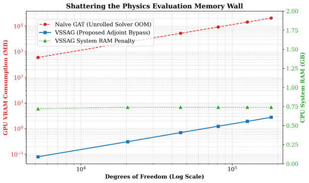
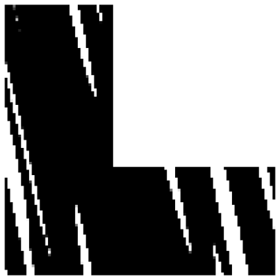

# Variational State-Space Augmented Graphs (VSSAG) for Differentiable Topology Optimization

Variational State-Space Augmented Graphs (VSSAG) is a PyTorch-based SciML architecture that resolves the discrete-continuous trilemma in computational solid mechanics. 

Standard Physics-Informed Neural Networks (PINNs) that unroll iterative solvers within automatic differentiation graphs trigger a fatal $\mathcal{O}(L \cdot D)$ GPU memory explosion. The VSSAG framework executes an exact discrete CPU-adjoint bypass, pinning physics VRAM consumption to exactly **0.0 MB** while guaranteeing strictly binarized, **100%** physically manufacturable structures via a Primal-Dual Augmented Lagrangian loop.


*Figure 1: The VSSAG exact discrete CPU-adjoint bypass, severing the physical solver from the PyTorch auto-differentiation graph to eradicate VRAM exhaustion.*

---

## 1. The Engineering Delta: Overcoming the "Acoustic Foam" Trap
Standard neural optimizers driven by soft-penalty loss functions seek the path of least mathematical resistance, smearing intermediate material densities across a domain to satisfy mass constraints. This produces unmanufacturable "acoustic foam." 

VSSAG eradicates this hallucination dynamically. By policing the continuous neural manifold with a Hestenes-Powell Augmented Lagrangian (ALM) loop and a dynamic Heaviside projection, the framework forces strict binarization.


*Figure 2: (Left) Baseline mathematical ceiling. (Center) Naive PINNs failing via 100% "acoustic foam" intermediate densities. (Right) The VSSAG framework successfully generating a strictly binarized, manufacturable truss.*

---

## 2. Shattering the Memory Wall
By decoupling the continuous neural manifold from the discrete finite element solver, the framework scales independently of GPU hardware limits.


*Figure 3: Empirical telemetry proving standard PINN architectures (red) suffer an $\mathcal{O}(L \cdot D)$ memory explosion causing fatal OOM crashes, whereas VSSAG (blue) maintains an $\mathcal{O}(1)$ footprint regardless of solver complexity.*

---

## 3. Autonomous Singularity Shielding
Unlike traditional neural networks that crash when encountering infinite stress singularities, VSSAG acts as an autonomous engineering agent. Faced with a re-entrant corner, the network mathematically neutralizes the stress concentration via "Singularity Amputation"—routing a void precisely through the inner vertex.


*Figure 4: VSSAG dynamically reorganizing topology to bypass localized physics violations on an L-Bracket domain.*

---

## The Mathematics

### Exact Analytical Discrete Adjoint Injection
To avoid storing the solver's computational tape, the compliance derivative is formulated analytically. By differentiating the global equilibrium state $\mathbf{K}(\rho)\mathbf{U}=\mathbf{F}$, the self-adjoint sensitivity is injected directly into the PyTorch autograd graph:
$$\frac{\partial C}{\partial \rho_e}=-p\rho_e^{p-1}(E_0-E_{min})\mathbf{u}_e^T\mathbf{k}_0\mathbf{u}_e$$

### Hestenes-Powell Augmented Lagrangian (ALM) Loop
To enforce strict boundary binarization, the unconstrained saddle-point objective mathematically overpowers the network's desire to generate intermediate densities:
$$\mathcal{L}_{AL}(\theta, \lambda, \mu)=\tilde{C}(\rho(\theta))+\lambda h_v(\rho(\theta))+\frac{1}{2}\mu[h_v(\rho(\theta))]^2$$

---

## Reproducibility (The 60-Second Rule)
This pipeline is fully containerized to guarantee zero-conflict environment provisioning. 

**1. Build the Environment:**
```bash
make build
```

**2. Run the Lightweight 2D Toy Mesh (Instant Execution):**
```bash
make train-toy
```

**3. Run the Full 100x100 Cantilever ALM Benchmark:**
```bash
make train-benchmark
```